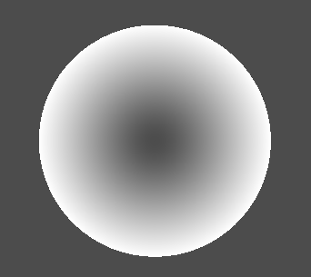

# Energy Shield

## Index

- [Energy Shield](#energy-shield)
  - [Index](#index)
  - [Description](#description)
  - [Fresnel reflection](#fresnel-reflection)

## Description

>*Energy shield shader with impact effect made with **Godot 4.1.1 / Vulcan***

Hi! This is my first complete shader. I decided to go easy with it and make an energy shield, combining a `frsnel shader` for the color and a `ripple shader` to make waves to simulate impacts.

## Fresnel reflection

>*Reflection computed using the vertices' normal. Higher the angle, stronger the reflection.*


Using the dot product between the `VIEW` vector and each vertex normal of the mesh, we can calculate the intensity of the alpha, color, emission, etc...

$$
fresnel = 1 - dot(vertex.N, VIEW)
$$

When the angle between `View` and `vertex.N` is 0, the dot product return 0. Viceversa, steeper angles returns higher valuers, saturating at 1 when the angle reaches 90 deg.



As we can see the borders of the sphere, which faces 


```
if dot(view, v.normal) == 0:
    
```