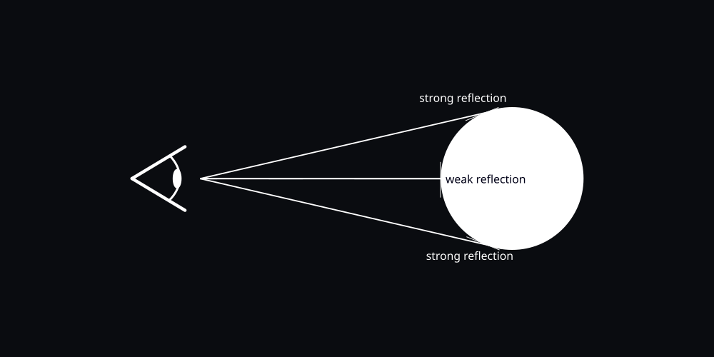
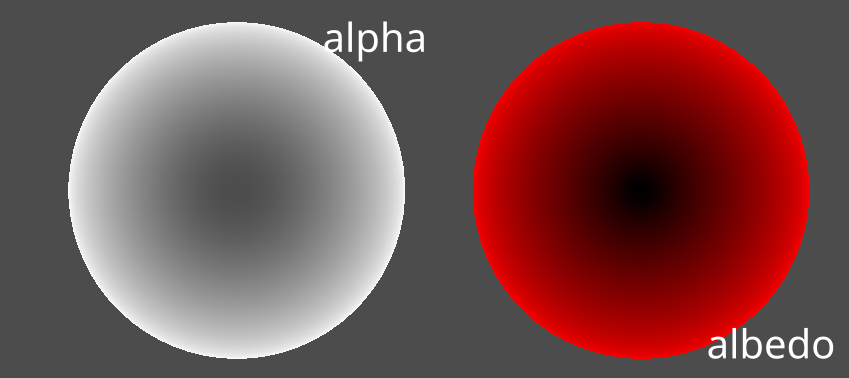
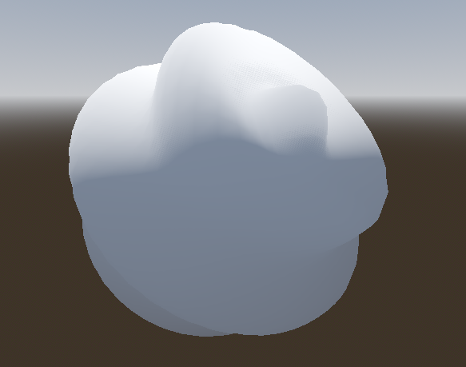
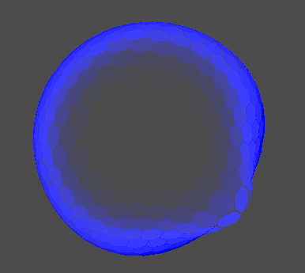
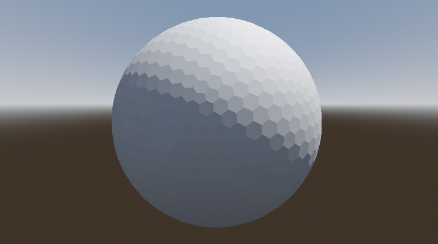

- [Energy Shield](#energy-shield)
  - [Description](#description)
  - [Fresnel reflection](#fresnel-reflection)
  - [Ripple effect](#ripple-effect)
  - [Shield](#shield)
  - [TODO](#todo)
  - [Credits](#credits)

# Energy Shield

Hi! This is my first complete shader. I decided to go easy with it and make an energy shield, combining a `frsnel shader` for the color and a `ripple shader` to make waves to simulate impacts.

>**NOTE**: *this is just a project I used to learn shaders. It is rough and incomplete but i'll try to update it as I learn new stuff!*

## Description

>*Energy shield shader with impact effect made with **Godot 4.1.1 / Vulkan API 1.3.194***

## Fresnel reflection

>*Reflection computed using the vertices' normal. Higher the angle, stronger the reflection.*

Using the dot product between the `VIEW` vector and each vertex normal of the mesh, we can calculate the intensity of the alpha, color, emission, etc...

$$
fresnel = 1 - dot(vertex.N, VIEW)
$$

When the angle between `View` and `vertex.N` is 0, the dot product return 0. Viceversa, steeper angles returns higher valuers, saturating at 1 when the angle reaches 90 deg. Combining it with the alpha value, we can get an interesting transparency effect

$$
ALPHA = ALPHA * frsnel
$$

As we can see, the borders of the sphere have a higher alpha value, compared with the center where normals are parallel to the view vector.

To modulate the intenisty we can raise fresnel to power of n, where higher the exponent, weaker the transition from the center to the border.

$$
fresnel = (1 - dot(vertex.N, VIEW))^n
$$

## Ripple effect

>*Displace vertices to create a wave over the sphere*

For each verex, compute the distance from an origine point in space (this allow us to change the orgini of the effect).

$$
dist = length(vertex - origin)
$$

Muove each vertex, along their normal using a sine function and the distance. 

$$
VERTEX = NORMAL * sin(TIME * speed + dist*density) / amplitude
$$

To create a cooler effect we can add a fade effect to meke the ripple deform only part of the mesh. We can use a smoothstep function to achive this.

## Shield

>*Combining the previus effects we can achive further complex results*.

To test the shader, play the `Sample.tscn`. 

- By clicking on the sphere you can start the animation. 
- Changing the curves, allow some adjustments for the animation.
- Changing the paramenter `mAnimTime` (in the script `impact.cs`), changes the duration of the animation.

To create an useful pattern for the shiel I used a custom mesh.

Also, applying a rotation matrix we can make the mesh spin around its center (**NOTE**: in order to do so we need to have local space coordinate for each vertex).

## TODO

- [X] Fresnel
- [X] Ripple
- [X] Add hexagon mesh
- [X] Interaction with shield
- [ ] Allow multiple impact
- [ ] Improve visual effect adding texturs
- [ ] Add custom animations for idle

## Credits

- https://docs.godotengine.org/en/4.0/tutorials/shaders/shader_reference/spatial_shader.html
- https://www.brainvoyager.com/bv/doc/UsersGuide/CoordsAndTransforms/SpatialTransformationMatrices.html
- https://www.ronja-tutorials.com/post/012-fresnel/
- https://www.youtube.com/watch?v=o4CGL2YXs5k
- https://www.youtube.com/watch?v=QsLkb1aOkb8&t=2s
- https://www.youtube.com/watch?v=IZAzckJaSO8