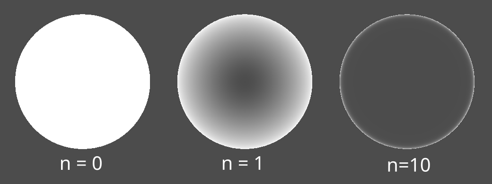

- [Energy Shield](#energy-shield)
  - [Description](#description)
  - [Fresnel reflection](#fresnel-reflection)
  - [Credits](#credits)

# Energy Shield

Hi! This is my first complete shader. I decided to go easy with it and make an energy shield, combining a `frsnel shader` for the color and a `ripple shader` to make waves to simulate impacts.

## Description

>*Energy shield shader with impact effect made with **Godot 4.1.1 / Vulcan***

## Fresnel reflection

>*Reflection computed using the vertices' normal. Higher the angle, stronger the reflection.*

Using the dot product between the `VIEW` vector and each vertex normal of the mesh, we can calculate the intensity of the alpha, color, emission, etc...

$$
fresnel = 1 - dot(vertex.N, VIEW)
$$

When the angle between `View` and `vertex.N` is 0, the dot product return 0. Viceversa, steeper angles returns higher valuers, saturating at 1 when the angle reaches 90 deg. Combining it with the alpha value, we can get an interesting transparency effect

$$
ALPHA = ALPHA * frsnel
$$

As we can see, the borders of the sphere have a higher alpha value, compared with the center where normals are parallel to the view vector.

To modulate the intenisty we can raise fresnel to power of n, where higher the exponent, weaker the transition from the center to the border.

$$
fresnel = (1 - dot(vertex.N, VIEW))^n
$$

## Credits

- https://www.ronja-tutorials.com/post/012-fresnel/
- https://www.youtube.com/watch?v=o4CGL2YXs5k
- https://www.youtube.com/watch?v=QsLkb1aOkb8&t=2s